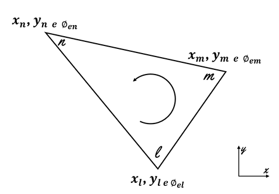
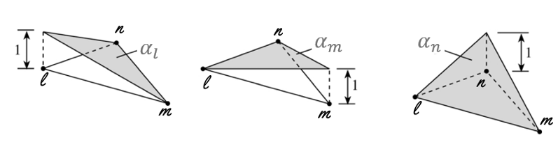

# Estudo MEFinito 2D Anisotrópico

### 3.1 Método de Elementos Finitos bidimensional

Para calcular a distribuição do potencial elétrico $\phi(x, y)$ num espaço bidimensional, a região de interesse pode ser subdividida num número finito de elemento como visto na figura 3.1.1  

Figura 3.1.1 – Região de interesse (azul) subdividida em elementos finitos triangulares - adaptado de (MIRANDA, 2000).  

Por conveniência, a distribuição de potencial pode ser considerada contínua na fronteira dos elementos, sendo assim, a solução para toda a região pode ser aproximada pela equação 3.1,

$$
\phi(x,y) \simeq \sum_{e=1}^{N} w_e \phi_e(x,y) \tag{3.1}
$$

onde $N$ é o número de elementos, $w_e$ vale 1 quando $(x,y)$ estiver contido no i-ésimo elemento e vale 0 caso contrário, $\phi_e(x,y)$ é o potencial elétrico dentro do i-ésimo elemento da malha. A função de interpolação linear de $\phi_e(x,y)$ pode ser determinada aproximadamente pela equação 3.2.
$$
\phi_e(x,y) = a + bx + cy \tag{3.2}
$$
A equação 3.2 pode ser representada em sua forma vetorial, mais conveniente para o desenvolvimento das equações de elementos finitos.
$$
\phi(x,y) = [1 \;\; x \;\; y] 
\begin{Bmatrix}
a \\
b \\
c
\end{Bmatrix} \tag{3.3}
$$
As constantes *a, b* e *c* devem ser determinadas. O potencial $\phi_e$, em geral, é diferente de zero dentro do elemento '$e$' e zero fora dele. A variação de potencial dentro do elemento triangular é suposta linear na equação **3.2**, isso implica que o campo elétrico é uniforme dentro do elemento, ou seja,
$$
\mathbf{E}_e = - \nabla \phi_e \tag{3.4}
$$
$$
\nabla \phi_e = \left( \frac{\partial \phi}{\partial x}, \frac{\partial \phi}{\partial y} \right) \tag{3.5}
$$
ou,
$$
\frac{\partial \phi_e}{\partial x} = \frac{\partial}{\partial x}(a + bx + cy) = b,
\qquad
\frac{\partial \phi_e}{\partial y} = \frac{\partial}{\partial y}(a + bx + cy) = c
$$
Sejam $\hat{n}_x = (1,0)$ e $\hat{n}_y = (0,1)$, vetores unitários nos sentidos $x$ e $y$, então, por meio da equação **3.4** podemos representar o campo elétrico $E_e$ do elemento finito da seguinte maneira:
$$
\mathbf{E}_e = - ( b[1,0] + c[0,1] )
$$
$$
= ( -[b,0] - [0,c] )
$$
$$
= (-b, -c)
$$
Portanto,
$$
\mathbf{E}_e = - ( b \hat{a}_x + c \hat{a}_y ) \tag{3.6}
$$

### 3.2 Equações para elementos finitos bidimensionais

Figura 3.2.1 – Elemento triangular.

Para determinar as equações necessárias ao cálculo dos potenciais elétricos $\phi_e(x,y)$ de uma região bidimensional pelo MEF, pode-se considerar o elemento triangular da figura **3.2.1**, onde os potenciais elétricos $\phi_{el}, \phi_{em}$ e $\phi_{en}$, localizados nos nós $l, m$ e $n$, são obtidos por meio da equação **3.3**.
$$
\begin{Bmatrix}
\phi_{el} \\
\phi_{em} \\
\phi_{en}
\end{Bmatrix}
=
\begin{bmatrix}
1 & x_l & y_l \\
1 & x_m & y_m \\
1 & x_n & y_n
\end{bmatrix}
\begin{Bmatrix}
a \\
b \\
c
\end{Bmatrix}
\tag{3.7}
$$
ou,
$$
\begin{Bmatrix}
a \\
b \\
c
\end{Bmatrix}
=
\begin{bmatrix}
1 & x_l & y_l \\
1 & x_m & y_m \\
1 & x_n & y_n
\end{bmatrix}^{-1}
\begin{Bmatrix}
\phi_{el} \\
\phi_{em} \\
\phi_{en}
\end{Bmatrix}
=
[\mathbf{M}]^{-1} \{ \phi_{ei} \}
\tag{3.8}
$$
Desta maneira, os coeficientes $a, b$ e $c$ podem ser determinados por meio da equação **3.8**. Para isso, precisamos calcular a inversa da matriz $[M]$ por meio de:
$$
[\mathbf{M}]^{-1} = \frac{1}{\det(\mathbf{M})} \, \text{Adj}(\mathbf{M}) \tag{3.9}
$$
Para calcular a matriz adjunta $\text{Adj}[\mathbf{M}]$, precisamos transpor a matriz $[\mathbf{M}]$, e em seguida, determinar os cofatores da nova matriz $[\mathbf{M}]^T$.
$$
[\mathbf{M}]^T =
\begin{bmatrix}
1 & 1 & 1 \\
x_l & x_m & x_n \\
y_l & y_m & y_n
\end{bmatrix}
$$
Os cofatores de uma matriz $3 \times 3$ são calculados por meio da seguinte equação 
$$
C_{ij} = (-1)^{i+j} M_{ij},
$$
onde $M_{ij}$ é um **menor** da matriz $[\mathbf{M}]^T$, de um dado elemento de índices $i$ e $j$.

Cálculo dos **menores** $(M_{ij})$ de cada elemento da matriz $[\mathbf{M}]^T$:
$$
|M_{11}| = \det \begin{bmatrix}
x_m & x_n \\
y_m & y_n
\end{bmatrix}
= x_m y_n - x_n y_m,
\qquad
|M_{12}| = \det \begin{bmatrix}
x_l & x_n \\
y_l & y_n
\end{bmatrix}
= x_l y_n - x_n y_l,
$$
$$
|M_{13}| = \det \begin{bmatrix}
x_l & x_m \\
y_l & y_m
\end{bmatrix}
= x_l y_m - x_m y_l,
\qquad
|M_{21}| = \det \begin{bmatrix}
1 & 1 \\
y_m & y_n
\end{bmatrix}
= y_n - y_m,
$$
$$
|M_{22}| = \det \begin{bmatrix}
1 & 1 \\
y_l & y_n
\end{bmatrix}
= y_n - y_l,
\qquad
|M_{23}| = \det \begin{bmatrix}
1 & 1 \\
y_l & y_m
\end{bmatrix}
= y_m - y_l,
$$
$$
|M_{31}| = \det \begin{bmatrix}
1 & 1 \\
x_m & x_n
\end{bmatrix}
= x_n - x_m,
\qquad
|M_{32}| = \det \begin{bmatrix}
1 & 1 \\
x_l & x_n
\end{bmatrix}
= x_n - x_l,
$$
$$
|M_{33}| = \det \begin{bmatrix}
1 & 1 \\
x_l & x_m
\end{bmatrix}
= x_m - x_l
$$
Cálculo dos **cofatores** $(C_{ij})$ de cada elemento da matriz $[\mathbf{M}]^T$.

$$
C_{11} = (-1)^{1+1} M_{11} = M_{11}, \qquad
C_{12} = (-1)^{1+2} M_{12} = -M_{12},
$$
$$
C_{13} = (-1)^{1+3} M_{13} = M_{13}, \qquad
C_{21} = (-1)^{2+1} M_{21} = -M_{21},
$$
$$
C_{22} = (-1)^{2+2} M_{22} = M_{22}, \qquad
C_{23} = (-1)^{2+3} M_{23} = -M_{23},
$$
$$
C_{31} = (-1)^{3+1} M_{31} = M_{31}, \qquad
C_{32} = (-1)^{3+2} M_{32} = -M_{32},
$$
$$
C_{33} = (-1)^{3+3} M_{33} = M_{33}.
$$
A matriz adjunta de $[\mathbf{M}]$ será:

$$
\text{Adj}[\mathbf{M}] =
\begin{bmatrix}
C_{11} & C_{12} & C_{13} \\
C_{21} & C_{22} & C_{23} \\
C_{31} & C_{32} & C_{33}
\end{bmatrix}
=
\begin{bmatrix}
M_{11} & -M_{12} & M_{13} \\
-M_{21} & M_{22} & -M_{23} \\
M_{31} & -M_{32} & M_{33}
\end{bmatrix}
$$
$$
\text{Adj}[\mathbf{M}] =
\begin{bmatrix}
(x_m y_n - x_n y_m) & (x_n y_l - x_l y_n) & (x_l y_m - x_m y_l) \\
(y_m - y_n) & (y_n - y_l) & (y_l - y_m) \\
(x_n - x_m) & (x_l - x_n) & (x_m - x_l)
\end{bmatrix}
\tag{3.10}
$$
Em seguida, calculamos o determinante da matriz $[M]$ que, neste caso, é igual a duas vezes a área do elemento finito triangular.

$$
[M] =
\begin{bmatrix}
1 & x_l & y_l \\
1 & x_m & y_m \\
1 & x_n & y_n
\end{bmatrix},
\qquad
\det[M] =
\begin{vmatrix}
1 & x_l & y_l \\
1 & x_m & y_m \\
1 & x_n & y_n
\end{vmatrix}
= 2A
$$
$$
\det[M] =
\begin{vmatrix}
1 & x_l & y_l & 1 & x_l \\
1 & x_m & y_m & 1 & x_m \\
1 & x_n & y_n & 1 & x_n
\end{vmatrix}
= x_m y_n + x_l y_m + y_l x_n - x_m y_l - x_n y_m - y_n x_l
$$
$$
\det[M] = (x_l y_m - x_m y_l) + (x_n y_l - x_l y_n) + (x_m y_n - x_m y_m) = 2A
$$
Portanto,
$$
\det[M] = \left[ (x_m - x_l)(y_n - y_l) - (x_n - x_l)(y_m - y_l) \right] = 2A \tag{3.11}
$$
e consequentemente,
$$
A = \tfrac{1}{2} \left[ (x_m - x_l)(y_n - y_l) - (x_n - x_l)(y_m - y_l) \right] \tag{3.12}
$$
Substituindo as equações **3.10** e **3.11** na equação **3.3** temos:

>Obs.:
>$$
\phi(x,y) = [1 \;\; x \;\; y] 
\begin{Bmatrix}
a \\
b \\
c
\end{Bmatrix} 
$$

>$$
\begin{Bmatrix}
a \\
b \\
c
\end{Bmatrix}
=
\begin{bmatrix}
1 & x_l & y_l \\
1 & x_m & y_m \\
1 & x_n & y_n
\end{bmatrix}^{-1}
\begin{Bmatrix}
\phi_{el} \\
\phi_{em} \\
\phi_{en}
\end{Bmatrix}
=
[\mathbf{M}]^{-1} \{ \phi_{ei} \}
$$

>$$
\begin{Bmatrix}
a \\
b \\
c
\end{Bmatrix} =
\underbrace{
\frac{1}{2A}
\begin{bmatrix}
(x_m y_n - x_n y_m) & (x_m y_l - x_l y_n) & (x_l y_m - x_m y_l) \\
(y_m - y_n) & (y_n - y_l) & (y_l - y_m) \\
(x_n - x_m) & (x_l - x_n) & (x_m - x_l)
\end{bmatrix}}_{[M]^{-1}}
\begin{Bmatrix}
\phi_{el} \\
\phi_{em} \\
\phi_{en}
\end{Bmatrix}
$$

>$$
\phi(x,y) =
\begin{bmatrix}
1 & x & y
\end{bmatrix}
\underbrace{
\frac{1}{2A}
\begin{bmatrix}
(x_m y_n - x_n y_m) & (x_m y_l - x_l y_n) & (x_l y_m - x_m y_l) \\
(y_m - y_n) & (y_n - y_l) & (y_l - y_m) \\
(x_n - x_m) & (x_l - x_n) & (x_m - x_l)
\end{bmatrix}
\begin{Bmatrix}
\phi_{el} \\
\phi_{em} \\
\phi_{en}
\end{Bmatrix}}_{= \begin{Bmatrix} a \\b\\c\end{Bmatrix}}
\tag{3.13}
$$

ou,
$$
\phi_e = \sum_{i=1}^{3} \alpha_i(x,y) \, \phi_{ei} \tag{3.14}
$$
onde $A$ é área do elemento dada pela equação **3.12**, e será positivo se for numerado no sentido anti-horário, e $\alpha_i$ correspondem as equações de forma dos elementos triangulares.

$$
\alpha_l = \frac{1}{2A} \left[ (x_m y_n - x_n y_m) + (y_m - y_n)x + (x_n - x_m)y \right] \tag{3.15}
$$
$$
\alpha_m = \frac{1}{2A} \left[ (x_m y_l - x_l y_n) + (y_n - y_l)x + (x_l - x_n)y \right] \tag{3.16}
$$
$$
\alpha_n = \frac{1}{2A} \left[ (x_l y_m - x_m y_l) + (y_l - y_m)x + (x_m - x_l)y \right] \tag{3.17}
$$
A figura **3.2.2** apresenta as funções de forma $\alpha_l, \alpha_m$ e $\alpha_n$ para um elemento finito triangular. 
![[Pasted image 20250819143421.png]]
Figura 3.2.2 – Funções de forma do elemento triangular – adaptado de ([SADIKU, 2000]).

A função de forma tem as seguintes propriedades:

$$
\alpha_i =
\begin{cases}
1, & i = j \\
0, & i \neq j
\end{cases},
\qquad
\sum_{i=1}^{3} \alpha_i(x,y) = 1
\tag{3.18}
$$

# 4.1 Funcional anisotrófico
O modelo matemático cujas propriedades elétricas estão representadas pela condutividade $\sigma$ e a permitividade relativa $\epsilon$.  
Na fronteira do meio injeta-se uma corrente elétrica, que gera em seu interior, uma distribuição de potencial e um fluxo de corrente, sendo este último mais conhecido como densidade de corrente, que se escreve da forma:
$$
J = \sigma E + \epsilon \epsilon_0 \frac{\partial E}{\partial t}
$$
que é a corrente induzida no interior do campo elétrico $E$.

A constante $\epsilon_0$ representa a permitividade do espaço livre que será desconsiderada para simplificar o modelo. 

Considerando que:
$$E = -\nabla \phi \qquad e \qquad \nabla \cdot J = 0$$
obtemos a equação,
$$
\nabla \cdot (\sigma \nabla V) = 0
$$
denominada equação de Poisson.

Sabe-se que a energia por unidade associada ao elemento ’e’ é dada pela equação **3.19**, que representa o funcional referente à equação de Laplace $\nabla^2 \phi = 0$.
$$
\pi_i = \tfrac{1}{2} \iint_S \sigma |E|^2 dS 
= \tfrac{1}{2} \iint_S \sigma |\nabla \phi_i|^2 dS \tag{3.19}
$$
Podemos calcular o gradiente do potencial no elemento por meio da equação **3.14**,
$$
\nabla \phi_e = \sum_{i=1}^{3} \phi_{ei} \nabla \alpha_i \tag{3.20}
$$
Substituindo a equação **3.20** na **3.19** temos:
$$
\pi_e = \tfrac{1}{2} \sum_{i=1}^{3} \sum_{j=1}^{3} \sigma \phi_{ei} 
\left[ \iint_S \nabla \alpha_i \nabla \alpha_j \, dS \right] \phi_{ej} \tag{3.21}
$$
onde $\sigma$ é a condutividade elétrica da região.

